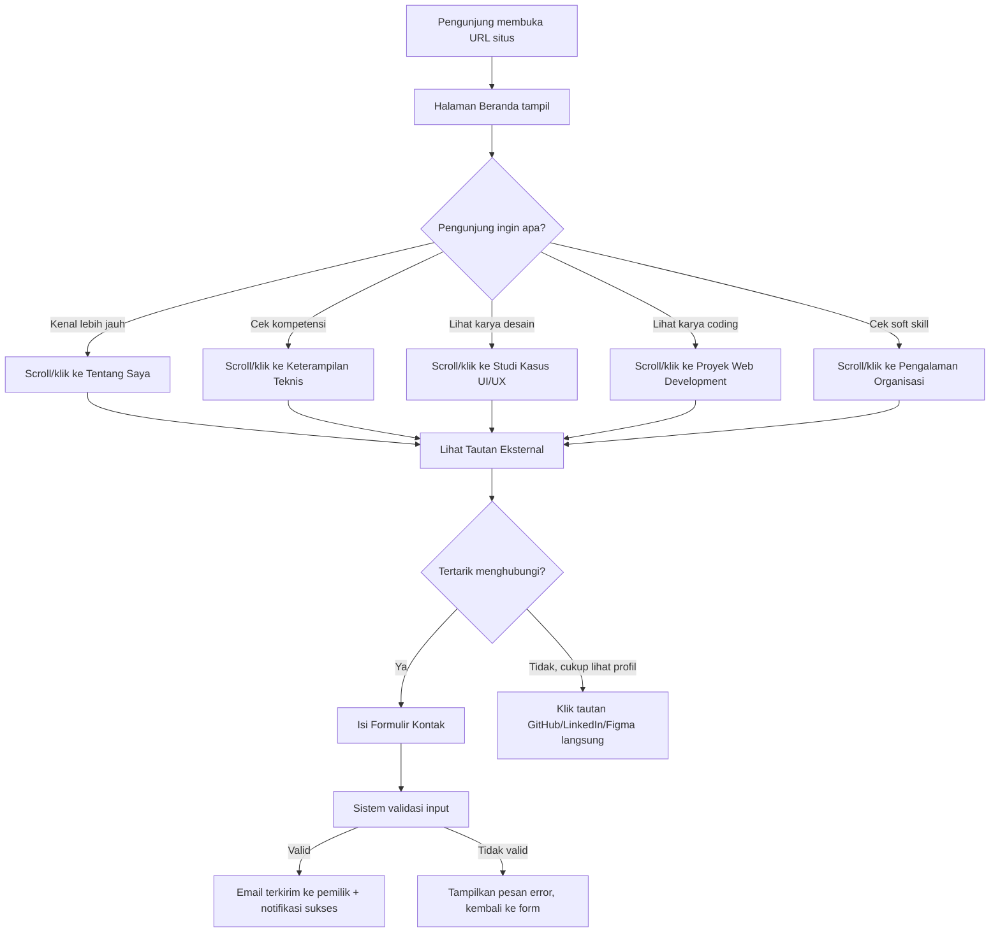
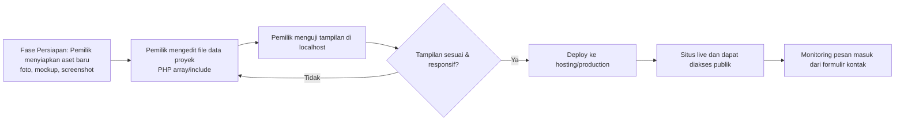

# Product Requirement Document (PRD)
## Portofolio Web — Personal Portfolio Website

**Versi Dokumen:** 1.0
**Tanggal:** 18 Juli 2026
**Disusun oleh:** Senior Product Manager (AI-assisted)
**Status:** Draft untuk Review Engineering

---

### 1. Gambaran Umum Produk

**Latar Belakang**

Saat ini, kandidat lulusan maupun profesional muda di bidang teknologi (khususnya yang bergerak di UI/UX Design dan Web Development) umumnya memamerkan karya mereka secara terpisah-pisah — misalnya CV dalam bentuk PDF statis, tautan Google Drive untuk mockup, profil LinkedIn yang terbatas formatnya, dan repository GitHub yang tidak memiliki konteks naratif. Kondisi ini menyulitkan pihak ketiga (recruiter, klien, dosen pembimbing, atau calon kolaborator) untuk memahami kompetensi seseorang secara utuh dalam satu tempat. Diperlukan sebuah *personal branding hub* berupa website portofolio yang terpusat, konsisten secara visual, ringan, dan mudah diakses dari perangkat apa pun.

**Pernyataan Masalah**

1. Karya (proyek UI/UX, proyek web development, dokumentasi organisasi) tersebar di berbagai platform sehingga sulit dievaluasi secara menyeluruh oleh satu pihak dalam satu sesi.
2. Banyak template portofolio yang tersedia di pasaran terkesan generik dan "AI slop" (hasil generate instan tanpa sentuhan personal), sehingga tidak mencerminkan keunikan dan kredibilitas pemilik portofolio.
3. Tidak semua template portofolio bersifat *responsive*, sehingga tampilan rusak atau sulit dibaca ketika diakses lewat perangkat mobile — padahal sebagian besar recruiter awal kali membuka tautan portofolio dari ponsel.
4. Proses menghubungi pemilik portofolio sering kali tidak praktis (harus mencari email secara manual) karena tidak adanya formulir kontak terintegrasi.

**Tujuan Produk**

Membangun website portofolio pribadi yang:
- Menyajikan identitas profesional, keterampilan teknis, dan hasil karya (UI/UX & Web Development) secara terstruktur dan meyakinkan.
- Tampil konsisten dan optimal di berbagai ukuran layar (desktop, tablet, mobile).
- Memiliki desain yang terasa personal, rapi, dan bebas dari kesan template AI generik.
- Memudahkan pengunjung untuk menghubungi pemilik portofolio melalui formulir kontak.

**Target Pengguna**

- **Pengunjung Umum (Recruiter/HR, Klien Freelance, Calon Kolaborator):** ingin mengevaluasi kompetensi pemilik portofolio secara cepat dan kredibel.
- **Dosen/Panitia Akademik atau Organisasi:** ingin melihat rekam jejak keterlibatan pemilik dalam kegiatan organisasi/sosial.
- **Pemilik Portofolio (Admin/Developer itu sendiri):** ingin memperbarui konten portofolio (proyek baru, keterampilan baru) dengan mudah tanpa mengubah struktur kode secara keseluruhan.

---

### 2. Peran Pengguna (User Roles) & User Stories

**Peran yang Didefinisikan:**
| Peran | Deskripsi |
|---|---|
| Pengunjung (Visitor) | Siapa pun yang mengakses situs untuk melihat konten portofolio |
| Pemilik Portofolio (Owner/Admin) | Pemilik situs yang mengelola dan memperbarui konten melalui kode/file sumber |

**User Stories — Pengunjung (Visitor)**

- Sebagai Pengunjung, saya ingin melihat halaman Beranda yang langsung menampilkan identitas dan value proposition pemilik, sehingga saya bisa langsung memahami siapa pemilik portofolio dalam hitungan detik.
- Sebagai Pengunjung, saya ingin membaca bagian Tentang Saya secara ringkas namun personal, sehingga saya bisa menilai latar belakang dan kepribadian profesional pemilik.
- Sebagai Pengunjung, saya ingin melihat daftar Keterampilan Teknis lengkap dengan ikon *tools* (Laravel, Flutter, Figma, SPSS, dll.), sehingga saya bisa cepat menilai kesesuaian kompetensi dengan kebutuhan saya.
- Sebagai Pengunjung, saya ingin menelusuri Studi Kasus UI/UX Design lengkap dengan wireframe dan mockup, sehingga saya bisa memahami proses berpikir desain pemilik, bukan hanya hasil akhirnya.
- Sebagai Pengunjung, saya ingin melihat Proyek Web Development beserta tangkapan layar antarmuka, sehingga saya bisa menilai kualitas implementasi teknis pemilik.
- Sebagai Pengunjung, saya ingin melihat Pengalaman Organisasi & Sosial beserta dokumentasi foto, sehingga saya bisa menilai soft skill dan kontribusi sosial pemilik.
- Sebagai Pengunjung, saya ingin mengakses Tautan Portofolio Eksternal (GitHub, Figma, LinkedIn) langsung dari satu tempat, sehingga saya tidak perlu mencari-cari akun tersebut secara manual.
- Sebagai Pengunjung, saya ingin mengisi Formulir Kontak sederhana, sehingga saya bisa menghubungi pemilik tanpa harus membuka aplikasi email terpisah.
- Sebagai Pengunjung, saya ingin situs tetap nyaman dibaca saat saya membukanya dari HP, sehingga pengalaman saya tidak terganggu oleh tampilan yang berantakan.

**User Stories — Pemilik Portofolio (Owner/Admin)**

- Sebagai Pemilik Portofolio, saya ingin struktur kode (HTML/PHP) yang modular per bagian/section, sehingga saya bisa menambah atau mengedit satu proyek baru tanpa merombak seluruh halaman.
- Sebagai Pemilik Portofolio, saya ingin data proyek (judul, deskripsi, gambar, tautan) dikelola secara terpisah dari tampilan (misalnya melalui array/include PHP), sehingga saya bisa menambah proyek baru dengan cepat dan konsisten.
- Sebagai Pemilik Portofolio, saya ingin formulir kontak mengirimkan notifikasi ke email saya, sehingga saya tidak perlu memantau situs secara manual untuk mengetahui adanya pesan masuk.
- Sebagai Pemilik Portofolio, saya ingin desain yang konsisten (warna, tipografi, spacing) di seluruh halaman menggunakan Tailwind CSS, sehingga saya tidak perlu menulis ulang gaya yang sama berkali-kali.

---

### 3. Ruang Lingkup (Scope of Work)

**In-Scope (MVP)**

- Halaman tunggal (single-page scroll) atau multi-section dengan navigasi anchor link ke: Beranda, Tentang Saya, Keterampilan Teknis, Studi Kasus UI/UX, Proyek Web Development, Pengalaman Organisasi & Sosial, Tautan Eksternal, Kontak.
- Komponen navigasi responsif (navbar dengan hamburger menu untuk mobile).
- Section Beranda dengan foto profil/avatar/ilustrasi, headline, dan CTA (misal tombol "Lihat Karya" & "Hubungi Saya").
- Section Tentang Saya dengan foto diri dan narasi singkat.
- Section Keterampilan Teknis dalam bentuk grid ikon/logo tools beserta label.
- Section Studi Kasus UI/UX dalam bentuk card/gallery yang menampilkan wireframe, mockup, dan ringkasan proses desain (problem → proses → solusi).
- Section Proyek Web Development dalam bentuk card berisi tangkapan layar, deskripsi singkat, tech stack yang dipakai, dan tautan (live demo/GitHub).
- Section Pengalaman Organisasi & Sosial dalam bentuk timeline atau card berisi foto dokumentasi dan deskripsi peran.
- Section Tautan Portofolio Eksternal (ikon GitHub, Figma, LinkedIn) yang dapat diklik.
- Section Kontak berisi formulir (Nama, Email, Pesan) yang diproses oleh PHP (mengirim email via `mail()`/SMTP) beserta ikon media sosial pendukung.
- Desain responsif penuh (mobile-first) menggunakan Tailwind CSS.
- Optimasi dasar SEO (meta title, meta description, semantic HTML).
- Validasi input formulir sisi client (HTML5) dan sisi server (PHP).

**Out-of-Scope (Fase Ini)**

- Dashboard admin berbasis login untuk mengelola konten (CMS custom).
- Database dinamis (MySQL/PostgreSQL) — konten dikelola langsung melalui file kode/array PHP.
- Fitur multi-bahasa (i18n).
- Sistem komentar atau interaksi pengunjung (like, review).
- Analytics dashboard internal (cukup integrasi Google Analytics/Search Console jika diperlukan, tanpa dashboard custom).
- Integrasi CMS pihak ketiga (WordPress, Strapi, dsb.).
- Dark mode / theme switcher (dapat menjadi *future enhancement*).

---

### 4. Kebutuhan Sistem (Functional & Non-Functional)

**Kebutuhan Fungsional**

| Kode | Kebutuhan |
|---|---|
| F-01 | Sistem menampilkan seluruh section portofolio dalam satu alur scroll dengan navigasi anchor yang smooth-scroll. |
| F-02 | Sistem menampilkan navbar sticky yang berubah menjadi menu hamburger pada breakpoint mobile (<768px). |
| F-03 | Sistem menampilkan galeri Studi Kasus UI/UX dan Proyek Web Development dalam bentuk grid/card yang dapat diklik untuk melihat detail (bisa berupa modal atau halaman detail terpisah). |
| F-04 | Sistem memproses formulir kontak: validasi field wajib (Nama, Email format valid, Pesan tidak kosong), lalu mengirim data ke email pemilik menggunakan PHP `mail()` atau SMTP (PHPMailer). |
| F-05 | Sistem menampilkan notifikasi status pengiriman formulir (berhasil/gagal) tanpa reload halaman penuh (dapat menggunakan minimal JavaScript fetch/AJAX bila diizinkan, atau redirect halaman status sederhana jika strict PHP-only). |
| F-06 | Sistem memuat gambar dengan teknik lazy-loading (`loading="lazy"`) untuk menjaga performa. |
| F-07 | Sistem menyediakan tautan eksternal (GitHub, Figma, LinkedIn) yang terbuka di tab baru (`target="_blank"` dengan `rel="noopener noreferrer"`). |

**Kebutuhan Non-Fungsional**

| Kode | Kebutuhan |
|---|---|
| NF-01 | **Performa:** Waktu muat halaman awal (First Contentful Paint) di bawah 2.5 detik pada koneksi 4G standar; ukuran total aset per halaman diusahakan di bawah 3MB. |
| NF-02 | **Keamanan:** Seluruh input formulir disanitasi dan divalidasi di sisi server (PHP) untuk mencegah XSS dan email header injection; gunakan `htmlspecialchars()` dan validasi `filter_var()` untuk email. |
| NF-03 | **Responsivitas:** Tampilan wajib teruji baik pada breakpoint mobile (≤640px), tablet (641–1024px), dan desktop (>1024px) menggunakan sistem breakpoint bawaan Tailwind CSS (`sm`, `md`, `lg`, `xl`). |
| NF-04 | **Ketersediaan:** Target uptime hosting minimal 99% (mengikuti SLA layanan hosting shared/VPS yang dipilih). |
| NF-05 | **Aksesibilitas:** Mematuhi prinsip dasar WCAG level A–AA (kontras warna memadai, atribut `alt` pada semua gambar, struktur heading semantik H1–H3 berurutan). |
| NF-06 | **Kompatibilitas Browser:** Berfungsi normal pada 2 versi terakhir Chrome, Firefox, Edge, dan Safari (termasuk Safari iOS). |
| NF-07 | **Maintainability:** Struktur kode PHP menggunakan `include`/`require` per section agar mudah dipelihara oleh satu developer tanpa framework backend tambahan. |

---

### 5. Aturan Bisnis (Business Rules)

1. Formulir kontak hanya dapat dikirim jika seluruh field wajib (Nama, Email, Pesan) terisi dan format email valid; jika tidak, sistem menampilkan pesan error dan tidak mengirim email.
2. Setiap gambar yang ditampilkan wajib memiliki atribut `alt` deskriptif — tidak boleh ada gambar tanpa teks alternatif (untuk aksesibilitas dan SEO).
3. Setiap card proyek (UI/UX maupun Web Development) wajib memiliki minimal satu tautan referensi (live demo, GitHub, atau Figma) — jika tidak tersedia, tampilkan label "Coming Soon" atau sembunyikan tombol tautan, bukan tautan kosong (`href="#"`).
4. Konten yang ditampilkan di halaman Beranda dan Tentang Saya harus konsisten dengan identitas yang sama (nama, foto, tone bahasa) di seluruh halaman.
5. Tidak ada proses submit ganda pada formulir kontak — tombol submit dinonaktifkan sementara (atau ditampilkan status "Mengirim...") selama proses pengiriman berlangsung untuk mencegah pengiriman email duplikat.
6. Seluruh tautan eksternal wajib divalidasi aktif secara berkala (tidak broken link) oleh pemilik situs sebagai bagian dari pemeliharaan konten.

---

### 6. Alur & Proses (User Flow & Business Flow)

**User Flow — Pengunjung Menjelajah Portofolio hingga Menghubungi Pemilik**



**Business Process Flow — Pengelolaan Konten oleh Pemilik**



---

### 7. Kriteria Penerimaan (Acceptance Criteria)

**Fitur: Formulir Kontak**

- **Given** pengunjung berada di section Kontak dan mengisi Nama, Email dengan format valid, serta Pesan,
  **When** pengunjung menekan tombol "Kirim",
  **Then** sistem mengirimkan email ke alamat pemilik dan menampilkan notifikasi "Pesan berhasil dikirim".

- **Given** pengunjung mengosongkan field Email atau mengisi format email yang tidak valid,
  **When** pengunjung menekan tombol "Kirim",
  **Then** sistem menampilkan pesan error yang jelas di dekat field terkait dan tidak mengirim email.

**Fitur: Navigasi Responsif**

- **Given** pengunjung mengakses situs dari layar dengan lebar kurang dari 768px,
  **When** halaman dimuat,
  **Then** navbar berubah menjadi ikon hamburger yang saat diklik menampilkan daftar menu secara vertikal/overlay.

**Fitur: Galeri Studi Kasus UI/UX**

- **Given** pengunjung berada di section Studi Kasus UI/UX,
  **When** pengunjung mengklik salah satu card studi kasus,
  **Then** sistem menampilkan detail proyek (wireframe, mockup, ringkasan proses) tanpa merusak tata letak halaman utama.

**Fitur: Tautan Eksternal**

- **Given** pengunjung berada di section Tautan Portofolio Eksternal,
  **When** pengunjung mengklik ikon GitHub/Figma/LinkedIn,
  **Then** tautan terbuka di tab baru dan tidak menggantikan halaman portofolio yang sedang dibuka.

---

### 8. Arsitektur Data & Tech Stack

**Struktur Data / Gambaran Konten**

> Catatan: Karena MVP tidak menggunakan database (lihat Out-of-Scope), "struktur data" berikut direpresentasikan sebagai struktur array/objek PHP per entitas konten, disimpan dalam file konfigurasi terpisah agar mudah dikembangkan menjadi tabel database di fase berikutnya.

| Entity | Atribut | Tipe Data | Keterangan |
|---|---|---|---|
| Profile | name, headline, bio, photo_url, cv_url | string | Data untuk section Beranda & Tentang Saya |
| Skill | id, name, category, icon_url | int, string, string, string | Data untuk section Keterampilan Teknis |
| CaseStudy | id, title, summary, problem, process, solution, images[], tools_used[] | int, string, text, text, text, text, array, array | Data untuk section Studi Kasus UI/UX |
| WebProject | id, title, description, screenshot_url, tech_stack[], demo_url, github_url | int, string, text, string, array, string, string | Data untuk section Proyek Web Development |
| Organization | id, org_name, role, period_start, period_end, description, photo_url | int, string, string, date, date, text, string | Data untuk section Pengalaman Organisasi & Sosial |
| ExternalLink | id, platform, url, icon | int, string, string, string | Data untuk section Tautan Eksternal |
| ContactMessage | name, email, message, sent_at | string, string, text, datetime | Data sementara dari formulir kontak sebelum dikirim via email (tidak disimpan permanen di MVP) |

**Gambaran "API" / Endpoint Pemrosesan (PHP-native, non-REST framework)**

Karena stack yang diminta murni PHP/HTML/CSS tanpa backend framework, "endpoint" berikut berbentuk file PHP pemroses (bukan REST API JSON), namun didokumentasikan dengan pola Method-Endpoint agar mudah dipahami tim engineering:

| Method | Endpoint (File) | Request Body | Response |
|---|---|---|---|
| POST | `/process/contact.php` | `name, email, message` | Redirect ke `?status=success` atau `?status=error&msg=...` |
| GET | `/index.php` | – | Halaman utama (render seluruh section dari data PHP include) |
| GET | `/case-study.php?id={id}` | Query param `id` | Halaman/partial detail studi kasus UI/UX |
| GET | `/project.php?id={id}` | Query param `id` | Halaman/partial detail proyek web development |
| GET | `/assets/{file}` | – | Static asset (gambar, ikon, CSS Tailwind hasil build) |

**Teknologi yang Digunakan (Tech Stack)**

Sesuai preferensi eksplisit pemilik produk (tanpa framework JS, tanpa AI-generated look):

- **Frontend:** HTML5 (semantic markup) + Tailwind CSS (utility-first, di-build via Tailwind CLI/PostCSS — bukan CDN, agar hasil akhir ringan dan production-ready) + JavaScript vanilla minimal (hanya untuk interaksi ringan: toggle navbar mobile, smooth scroll, modal galeri).
- **Backend:** PHP native (tanpa framework seperti Laravel, agar sesuai preferensi "PHP, CSS, HTML saja") untuk pemrosesan formulir kontak dan `include`/`require` antar-section.
- **Database:** Tidak digunakan pada MVP (data statis di file PHP). Disiapkan opsi migrasi ke MySQL di fase berikutnya jika diperlukan CMS.
- **Hosting/Cloud:** Shared hosting atau VPS ringan yang mendukung PHP native (misalnya cPanel hosting lokal, atau layanan seperti Hostinger/Niagahoster untuk pasar Indonesia); domain custom direkomendasikan untuk kredibilitas profesional.

**Struktur Proyek (Boilerplate)**

```
portofolio-web/
├── index.php                  # Entry point, merangkai semua section
├── includes/
│   ├── header.php             # Meta tag, navbar
│   ├── footer.php             # Footer, script penutup
│   ├── section-beranda.php
│   ├── section-tentang.php
│   ├── section-skill.php
│   ├── section-case-study.php
│   ├── section-web-project.php
│   ├── section-organisasi.php
│   ├── section-tautan.php
│   └── section-kontak.php
├── process/
│   └── contact.php            # Handler submit formulir kontak
├── data/
│   ├── skills.php             # Array data keterampilan
│   ├── case-studies.php       # Array data studi kasus UI/UX
│   ├── web-projects.php       # Array data proyek web dev
│   ├── organizations.php      # Array data pengalaman organisasi
│   └── external-links.php     # Array data tautan eksternal
├── assets/
│   ├── css/
│   │   ├── input.css          # Source Tailwind (@tailwind base/components/utilities)
│   │   └── output.css         # Hasil build Tailwind (production)
│   ├── js/
│   │   └── main.js            # Toggle navbar, smooth scroll, modal galeri
│   └── images/
│       ├── profile/
│       ├── skills-icons/
│       ├── case-studies/
│       ├── web-projects/
│       └── organizations/
├── tailwind.config.js
├── package.json
└── README.md
```

---

### 9. Asumsi, Batasan, & Risiko

**Asumsi**

- Pemilik portofolio memiliki seluruh aset visual (foto profil, screenshot proyek, ikon tools, dokumentasi kegiatan) sebelum development dimulai.
- Pengunjung mengakses situs menggunakan browser modern dengan dukungan CSS Grid/Flexbox dan JavaScript aktif.
- Konten portofolio akan diperbarui secara manual oleh pemilik melalui edit file kode, bukan melalui CMS visual.
- Volume trafik pada tahap awal tergolong rendah–menengah (portofolio personal), sehingga tidak memerlukan infrastruktur skala besar.

**Batasan Sistem**

- Karena tidak menggunakan database, penambahan konten baru (proyek/skill baru) memerlukan intervensi langsung ke file kode (bukan melalui form admin).
- Tanpa backend framework, fitur keamanan lanjutan (rate limiting, CSRF token otomatis) harus diimplementasikan manual oleh developer.
- Pengiriman email melalui `mail()` PHP native bergantung pada konfigurasi server hosting; jika hosting tidak mendukung SMTP yang andal, disarankan menggunakan PHPMailer dengan kredensial SMTP eksternal (misal Gmail SMTP/SendGrid) untuk deliverability yang lebih baik.
- Sistem dirancang untuk single-owner portfolio, bukan multi-tenant (tidak mendukung banyak pemilik portofolio dalam satu instance).

**Risiko Pengembangan**

| Risiko | Dampak | Mitigasi |
|---|---|---|
| Spam/abuse pada formulir kontak | Inbox pemilik dipenuhi pesan spam/bot | Tambahkan honeypot field tersembunyi dan/atau CAPTCHA sederhana (misal Google reCAPTCHA) |
| Email hasil `mail()` PHP masuk folder spam | Pesan penting dari pengunjung tidak terbaca | Gunakan SMTP resmi (PHPMailer + SPF/DKIM domain) alih-alih fungsi `mail()` bawaan |
| Desain terasa generik/template AI | Menurunkan kredibilitas personal branding | Terapkan panduan desain kustom (tipografi, palet warna, micro-interaction) sesuai arahan desain frontend, hindari komponen UI stok tanpa penyesuaian |
| Gambar berukuran besar memperlambat loading | Pengalaman pengguna menurun, terutama di mobile | Kompresi gambar (WebP), lazy-loading, dan penetapan dimensi eksplisit pada tag `` |
| Tautan eksternal proyek menjadi rusak (broken link) seiring waktu | Menurunkan kepercayaan pengunjung terhadap kredibilitas portofolio | Jadwalkan pengecekan tautan berkala oleh pemilik sebagai bagian dari maintenance rutin |

---

### 10. Pengembangan di Masa Depan (Future Enhancements)

- Dashboard admin sederhana dengan autentikasi untuk mengelola konten tanpa menyentuh kode langsung (CMS-lite berbasis database).
- Dark mode / theme switcher.
- Fitur blog/artikel untuk berbagi insight teknis atau proses desain secara berkala.
- Integrasi analytics visual (misal grafik jumlah pengunjung) langsung di dalam situs.
- Dukungan multi-bahasa (Indonesia/Inggris) untuk menjangkau recruiter internasional.
- Fitur unduh CV otomatis dalam format PDF yang di-generate dinamis dari data profil.
- Integrasi sistem notifikasi real-time (misal Telegram bot) saat ada pesan baru masuk dari formulir kontak.

---

### 11. Lampiran (Opsional)

**Glosarium Istilah**

- **MVP (Minimum Viable Product):** Versi produk dengan fitur inti minimum yang sudah dapat digunakan dan memberikan nilai bagi pengguna.
- **Mockup:** Representasi visual definitif dari desain antarmuka, biasanya sudah mendekati tampilan akhir.
- **Wireframe:** Kerangka dasar tata letak antarmuka tanpa detail visual final, digunakan pada tahap awal proses desain.
- **Lazy-loading:** Teknik pemuatan aset (gambar) secara bertahap sesuai kebutuhan scroll pengguna, untuk mempercepat waktu muat awal halaman.
- **Semantic HTML:** Penggunaan tag HTML sesuai makna strukturalnya (misal `<header>`, `<section>`, `<article>`) untuk meningkatkan aksesibilitas dan SEO.

**Referensi Preferensi Teknis dari Pemilik Produk**

- Framework CSS: Tailwind CSS (build via CLI, bukan CDN).
- Stack wajib: PHP, HTML, CSS — tanpa framework JavaScript frontend (React/Vue/dsb.) dan tanpa framework backend (Laravel/CodeIgniter/dsb.).
- Arahan desain: hindari kesan "AI slop" — desain harus terasa dipikirkan dan personal, bukan hasil template generik.
